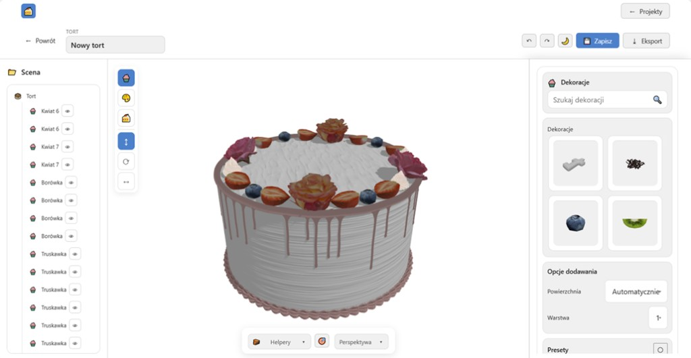
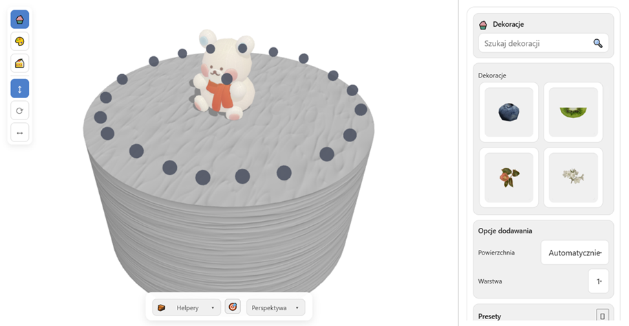
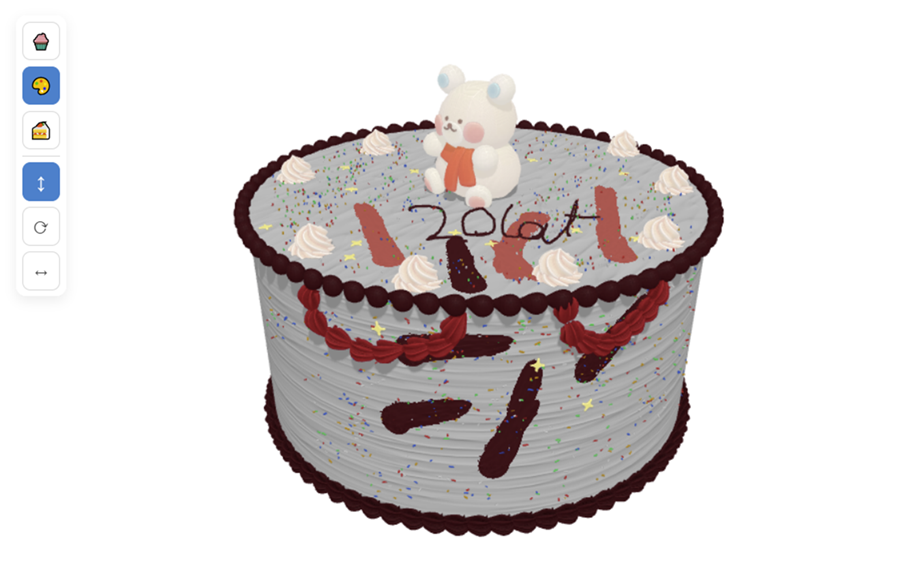
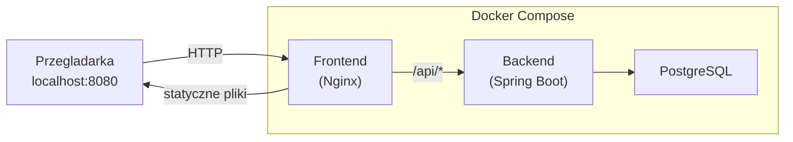

<h1 align="center">3D Cake Editor</h1>

<p align="center">
  Aplikacja webowa do projektowania i dekorowania tortow w 3D.<br>
  Tworzenie wielopietrowych tortow, nakladanie tekstur, polew, ozdob 3D, malowanie po powierzchni i eksport gotowego projektu.
</p>

<p align="center">
  
  
  
  
  
  
  
</p>

---

## Galeria

<p align="center">
  
</p>
<p align="center"><em>Pelny widok edytora z panelem dekoracji, lista sceny i opcjami dodawania</em></p>

<br>

<p align="center">
  &nbsp;&nbsp;
  
</p>
<p align="center">
  <em>Tekstury, figurki 3D i dekoracje &nbsp;|&nbsp; Malowanie po powierzchni, napisy i posypka</em>
</p>

---

## Demo

> 🔗 **[Wypróbuj edytor na żywo →](https://rafalliszcz.pl/)**

---

## Funkcjonalnosci

### Edytor 3D

- Podglad tortu w czasie rzeczywistym (Three.js)
- Wybor ksztaltu (cylinder / prostopadloscian), rozmiaru i liczby pieter
- Kamera perspektywiczna z helperami (siatka, osie)
- Cofanie / ponawianie zmian (undo / redo)

### Wyglad tortu

- Tekstury PBR (baseColor, normal, roughness, metallic, emissive) z powtarzaniem
- Kolory, gradienty
- Polewa z zaciekami (kolor, grubosc, dlugosc zaciekow, seed, tekstury)
- Oplatek — wgrywanie wlasnych obrazkow na powierzchnie tortu (skalowanie, maska, perspektywa)

### Dekoracje 3D

- Figurki, kwiaty, owoce, obrecze w formacie GLB/GLTF
- Drag-and-drop z panelu bocznego
- Zaznaczanie, przesuwanie, obracanie dekoracji na torcie
- System kotwic z automatycznym przyciaganiem do powierzchni

### Malowanie

- Pisak / pedzel do rysowania po powierzchni tortu
- Ekstruder (np. kremowe kropki, linie)
- Posypka (sprinkles)
- Napisy 3D na torcie (gora / bok, wybor czcionki, glebokosc)

### Eksport

- OBJ, STL, GLTF — gotowe modele 3D
- Zrzut ekranu PNG

### Presety

- Gotowe projekty tortow z miniaturami
- Panel administracyjny do zarzadzania presetami

### Konta i projekty

- Rejestracja z potwierdzeniem e-mail
- Logowanie JWT z automatycznym odswiezaniem sesji
- Reset hasla przez e-mail
- Zapisywanie i wczytywanie projektow z bazy danych

---

## Stos technologiczny

| Warstwa     | Technologia                                                |
|-------------|------------------------------------------------------------|
| Frontend    | Angular 19, TypeScript 5.7, Three.js r174, SSR/Prerender  |
| Backend     | Spring Boot 3.3, Java 17, Spring Security, Spring Data JPA |
| Baza danych | PostgreSQL 16                                              |
| Auth        | JWT (stateless), BCrypt, weryfikacja e-mail, reset hasla   |
| E-mail      | Spring Mail (SMTP, np. Gmail)                              |
| Deploy      | Docker Compose, Nginx (reverse proxy)                      |

---

## Szybki start

### Wymagania

- **Docker Desktop** (Windows/Mac) lub **Docker Engine + Compose plugin** (Linux)
- Konto Gmail z wlaczonym 2FA i wygenerowanym **haslem do aplikacji** (do wysylki maili)

### 1. Sklonuj repozytorium

```bash
git clone https://github.com/<user>/3D-Cake-Editor.git
cd 3D-Cake-Editor
```

### 2. Skonfiguruj zmienne srodowiskowe

```bash
cp .env.example .env
```

Edytuj `.env`:

```env
# Baza danych
POSTGRES_DB=cake_editor
POSTGRES_USER=cake_editor
POSTGRES_PASSWORD=devpass

# JWT
APP_JWT_SECRET=wpisz-dlugi-losowy-ciag-znakow
APP_JWT_EXPIRATION_MS=1800000

# SMTP (Gmail)
SPRING_MAIL_HOST=smtp.gmail.com
SPRING_MAIL_PORT=587
SPRING_MAIL_USERNAME=twoj-email@gmail.com
SPRING_MAIL_PASSWORD=xxxx-xxxx-xxxx-xxxx
APP_MAIL_FROM=twoj-email@gmail.com
APP_BASE_URL=http://localhost:8080
```

> **Gmail SMTP:** Google Account → Bezpieczenstwo → Weryfikacja dwuetapowa → Hasla do aplikacji → Wygeneruj haslo dla "Poczta". Wklej 16-znakowe haslo jako `SPRING_MAIL_PASSWORD`.

### 3. Zbuduj i uruchom

```bash
docker compose up --build
```

Pierwsze uruchomienie moze potrwac kilka minut (pobieranie obrazow, budowanie frontendu i backendu).

### 4. Otworz aplikacje

```
http://localhost:8080
```

---

## Domyslne konto administratora

Aplikacja automatycznie tworzy konto admina przy pierwszym uruchomieniu na podstawie zmiennych srodowiskowych `APP_ADMIN_EMAIL` i `APP_ADMIN_PASSWORD` (domyslnie skonfigurowanych w `application.yml` backendu). Admin ma dostep do panelu zarzadzania presetami w edytorze.

---

## Struktura projektu

```
3D-Cake-Editor/
├── backend/                    # Spring Boot API
│   ├── src/main/java/          # Kontrolery, serwisy, modele, konfiguracja
│   ├── src/main/resources/     # application.yml, migracje Flyway, seed thumbnails
│   ├── Dockerfile
│   └── pom.xml
├── frontend/                   # Angular 19 SPA
│   ├── src/app/
│   │   ├── cake-editor/        # Glowny komponent edytora 3D
│   │   ├── services/           # Serwisy (Three.js, auth, API, presety)
│   │   └── models/             # Interfejsy TypeScript
│   ├── public/assets/          # Modele 3D (.glb), tekstury, ikony dekoracji
│   ├── Dockerfile
│   └── angular.json
├── docker/
│   └── nginx.conf              # Konfiguracja Nginx (reverse proxy + SPA)
├── docker-compose.yml
├── .env.example
└── README.md
```

---

## Architektura



Nginx serwuje zbudowany frontend i przekierowuje zapytania `/api/*` do backendu.

---

## Komendy Docker

| Komenda | Opis |
|---------|------|
| `docker compose up --build` | Buduje i uruchamia wszystkie kontenery |
| `docker compose up -d` | Uruchamia w tle (detached) |
| `docker compose down` | Zatrzymuje kontenery |
| `docker compose down -v` | Zatrzymuje kontenery i usuwa dane (baza, uploady) |
| `docker compose logs backend` | Logi backendu |
| `docker compose logs -f` | Logi na zywo ze wszystkich kontenerow |
| `docker compose build --no-cache` | Przebudowuje obrazy od zera |

### Resetowanie danych

- **Pelny reset** (baza + uploady): `docker compose down -v`
- **Tylko baza**: `docker volume rm 3d-cake-editor_postgres_data`
- **Tylko uploady**: `docker volume rm 3d-cake-editor_uploads_data`

---

## API Endpoints

| Metoda | Endpoint | Opis | Auth |
|--------|----------|------|------|
| POST | `/api/auth/register` | Rejestracja nowego konta | — |
| POST | `/api/auth/login` | Logowanie (zwraca JWT) | — |
| GET | `/api/auth/verify` | Potwierdzenie e-mail | — |
| POST | `/api/auth/forgot-password` | Wysylka maila do resetu hasla | — |
| POST | `/api/auth/reset-password` | Ustawienie nowego hasla | — |
| GET | `/api/projects` | Lista projektow uzytkownika | JWT |
| POST | `/api/projects` | Utworzenie projektu | JWT |
| GET | `/api/projects/{id}` | Pobranie projektu | JWT |
| PUT | `/api/projects/{id}` | Zapis projektu | JWT |
| GET | `/api/decorations` | Lista dostepnych dekoracji 3D | — |
| GET | `/api/presets/cakes` | Lista gotowych tortow | — |
| POST | `/api/admin/presets/cakes` | Zapis nowego presetu (admin) | JWT+ADMIN |

---

## Rozwiazywanie problemow

| Problem | Rozwiazanie |
|---------|-------------|
| Backend nie startuje | Sprawdz logi: `docker compose logs backend` |
| Blad SMTP / email | Upewnij sie ze masz haslo do aplikacji Gmail (nie zwykle haslo) |
| 403 przy logowaniu | Potwierdz e-mail klikajac link w wiadomosci |
| Brak miniatur presetow | `docker compose down -v` i `docker compose up --build` |
| Lag w edytorze 3D | Sprawdz `chrome://gpu` — WebGL musi byc "Hardware accelerated" |
| Port 8080 zajety | Zmien port w `docker-compose.yml`: `ports: - "9090:80"` |
